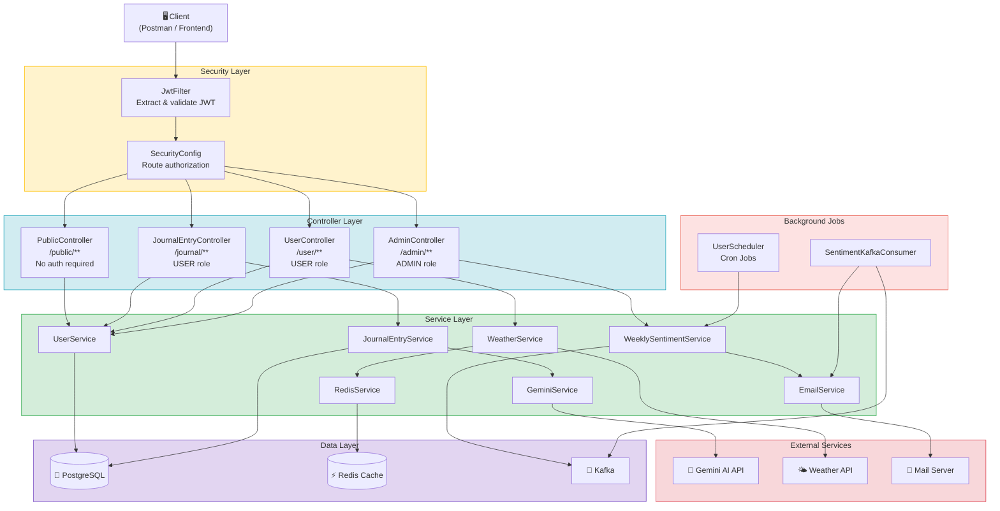
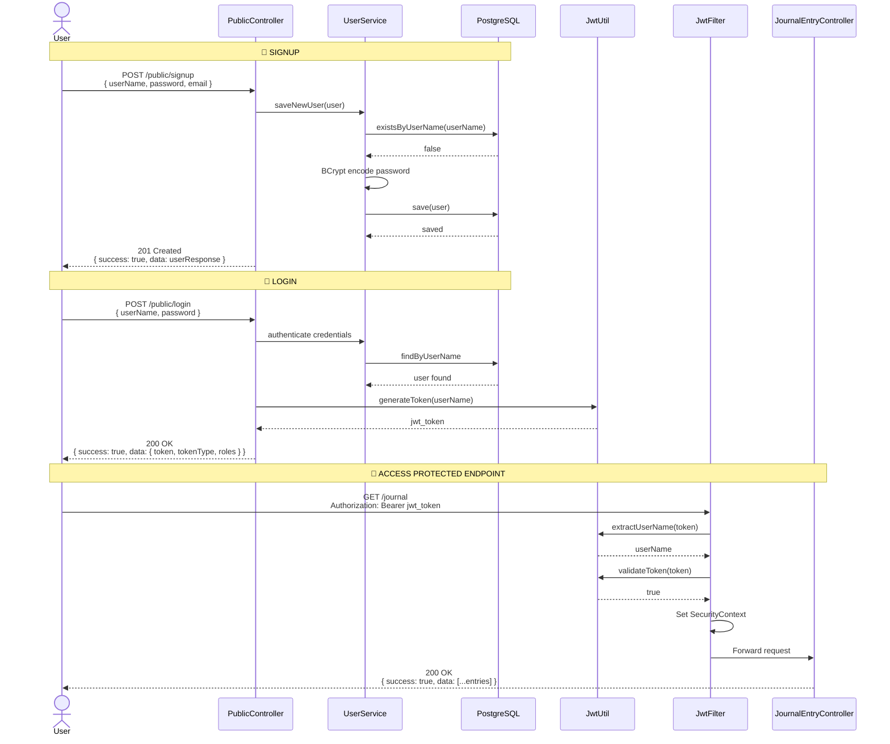
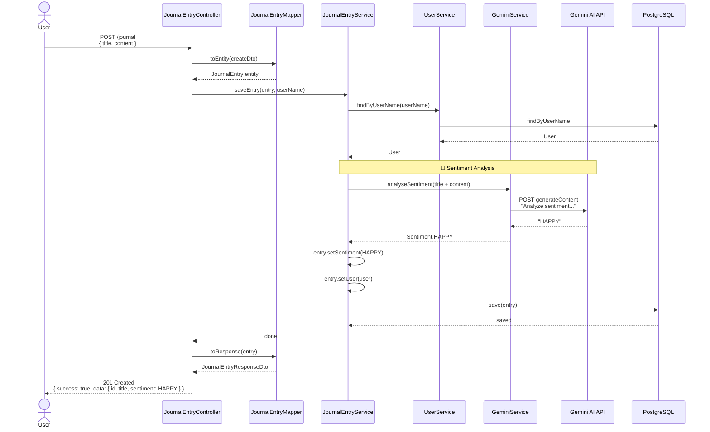
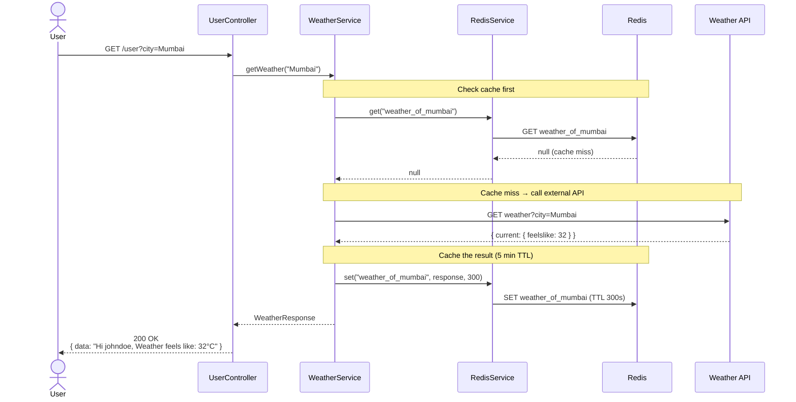
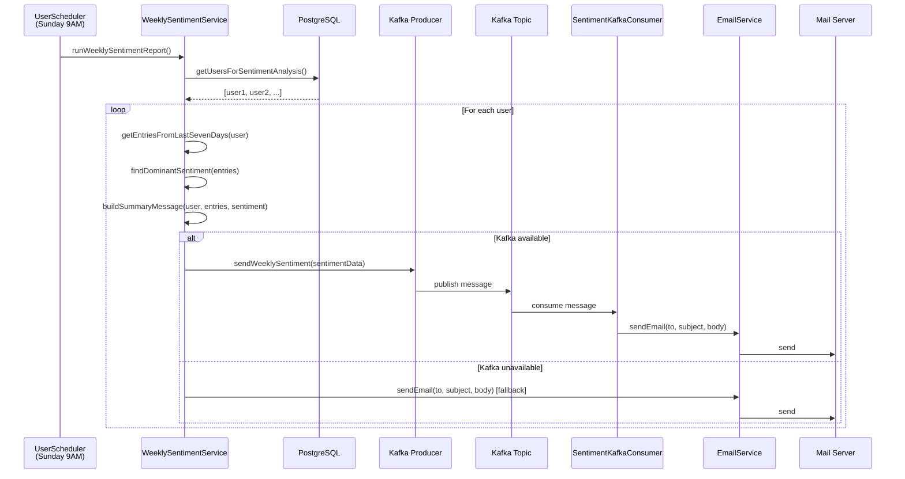
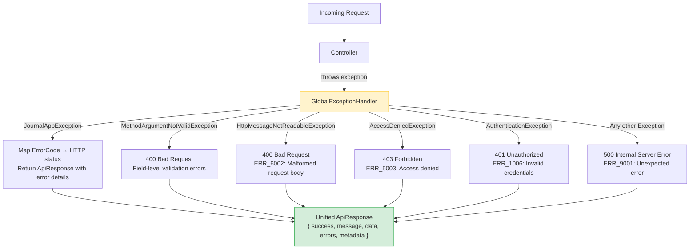
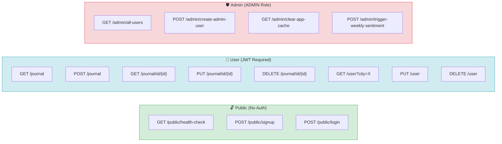

# Journal App - Flow Charts

## 1. Overall Architecture Flow

## 2. Authentication Flow (Signup → Login → Access)

## 3. Journal Entry Creation Flow (with Sentiment Analysis)

## 4. Weather Greeting Flow (with Redis Cache)

## 5. Weekly Sentiment Report Flow

## 6. Error Handling Flow

## 7. API Endpoint Map

