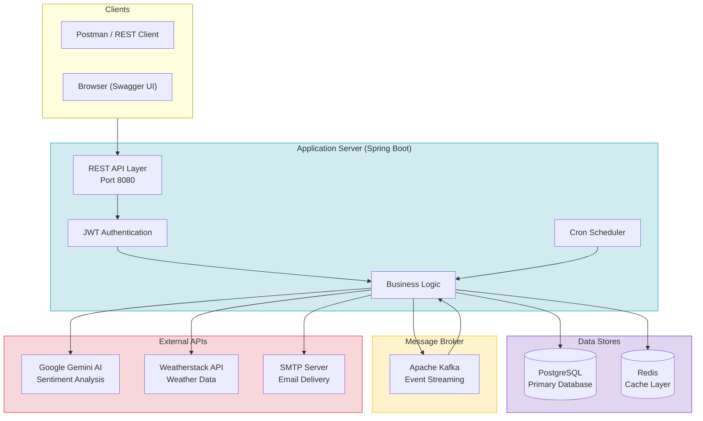
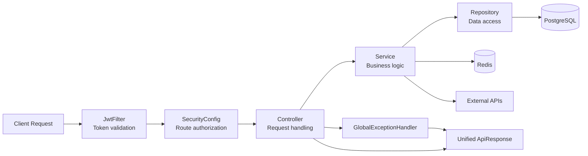
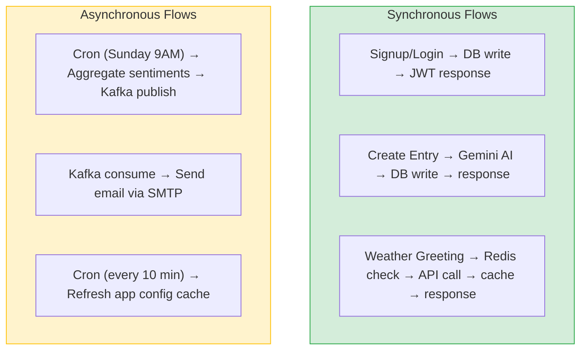
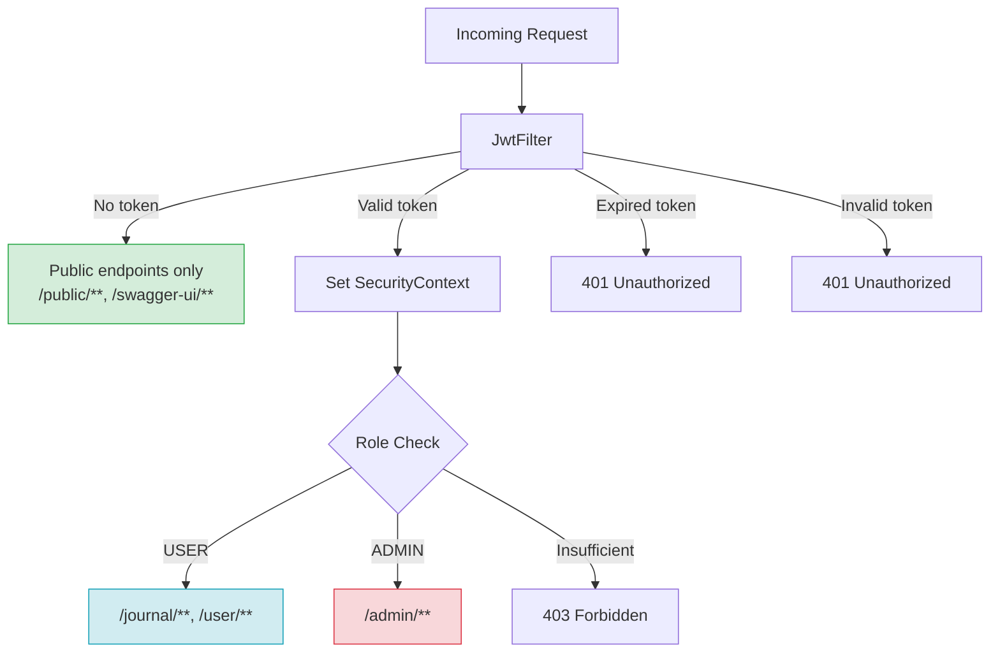
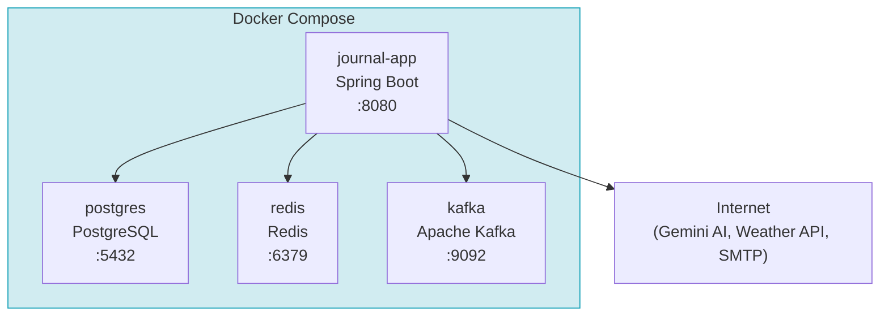

# Journal App - High Level Design (HLD)

## 1. System Overview

## 2. Component Responsibilities

| Component | Role |
|-----------|------|
| Spring Boot App | Hosts REST API, business logic, scheduling |
| PostgreSQL | Stores users, journal entries, app config |
| Redis | Caches weather API responses (5 min TTL) |
| Apache Kafka | Async event streaming for weekly sentiment reports |
| Gemini AI | Analyses journal entry text → returns sentiment (HAPPY/SAD/ANGRY/ANXIOUS) |
| OpenWeatherMap API | Provides current weather data by lat/lon coordinates |
| SMTP | Delivers weekly sentiment summary emails |

## 3. High-Level Request Flow

## 4. Data Flow Patterns

## 5. Security Architecture

## 6. Deployment Architecture

## 7. API Surface Summary

| Method | Endpoint | Auth | Description |
|--------|----------|------|-------------|
| GET | /public/health-check | None | Health check |
| POST | /public/signup | None | Register new user |
| POST | /public/login | None | Login, get JWT |
| GET | /journal | JWT | List user's entries |
| POST | /journal | JWT | Create entry (auto-sentiment) |
| GET | /journal/id/{id} | JWT | Get entry by ID |
| PUT | /journal/id/{id} | JWT | Update entry |
| DELETE | /journal/id/{id} | JWT | Delete entry |
| GET | /user?lat=X&lon=Y | JWT | Greeting + weather |
| PUT | /user | JWT | Update profile |
| DELETE | /user | JWT | Delete account |
| GET | /admin/all-users | ADMIN | List all users |
| POST | /admin/create-admin-user | ADMIN | Create admin |
| GET | /admin/clear-app-cache | ADMIN | Refresh config cache |
| POST | /admin/trigger-weekly-sentiment | ADMIN | Force sentiment report |
| GET | /admin/configs | ADMIN | List all configs |
| PUT | /admin/configs/{key} | ADMIN | Update config value |
| PUT | /admin/users/{username} | ADMIN | Update any user |
| GET | /admin/users/{username}/journals | ADMIN | View user's journals |