# Journal App - Low Level Design (LLD)

## 1. Package Structure

```mermaid
graph TD
    Root["com.trishal.journalApp"]

    Root --> controller["controller"]
    Root --> service["service"]
    Root --> repository["repository"]
    Root --> entity["entity"]
    Root --> dto["dto"]
    Root --> mapper["mapper"]
    Root --> config["config"]
    Root --> filter["filter"]
    Root --> exception["exception"]
    Root --> enums["enums"]
    Root --> utils["utils"]
    Root --> cache["cache"]
    Root --> kafka["kafka"]
    Root --> api["api"]
    Root --> model["model"]
    Root --> scheduler["scheduler"]
    Root --> constants["constants"]

    controller --> PublicCtrl["PublicController"]
    controller --> JournalCtrl["JournalEntryController"]
    controller --> UserCtrl["UserController"]
    controller --> AdminCtrl["AdminController"]

    service --> UserSvc["UserService"]
    service --> JournalSvc["JournalEntryService"]
    service --> GeminiSvc["GeminiService"]
    service --> WeatherSvc["WeatherService"]
    service --> RedisSvc["RedisService"]
    service --> EmailSvc["EmailService"]
    service --> WeeklySvc["WeeklySentimentService"]
    service --> impl["impl/UserDetailServiceImpl"]
```

## 2. Entity Relationship Diagram

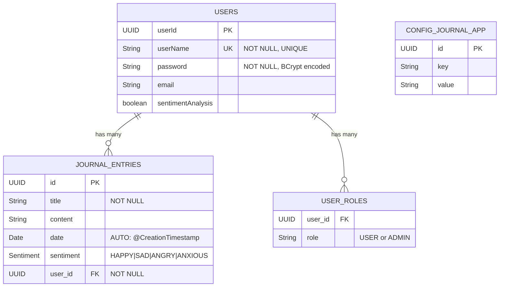

## 3. Class Diagram - Core Entities

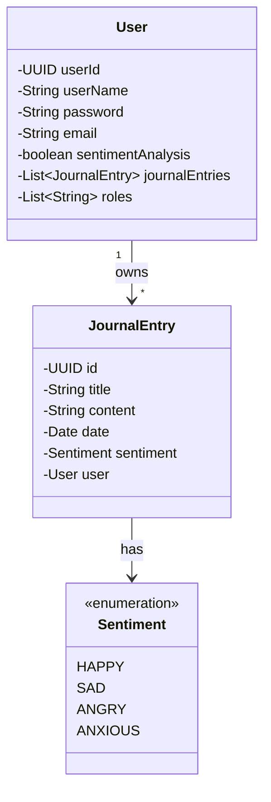

## 4. Class Diagram - Service Layer

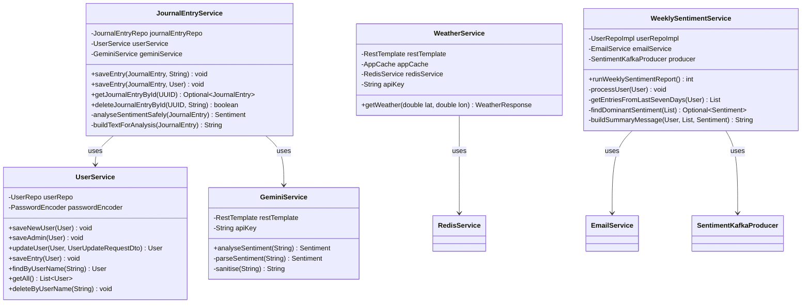

## 5. DTO Layer

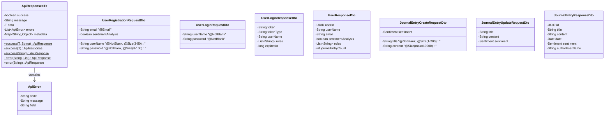

## 6. Exception Hierarchy

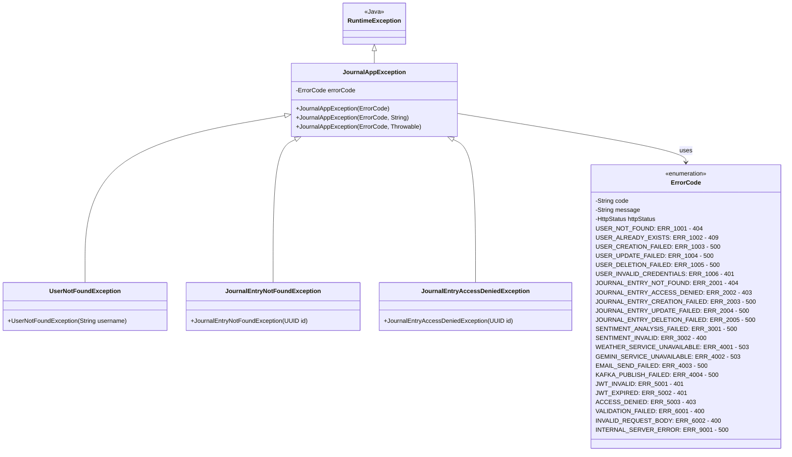

## 7. JWT Authentication Sequence (Detailed)

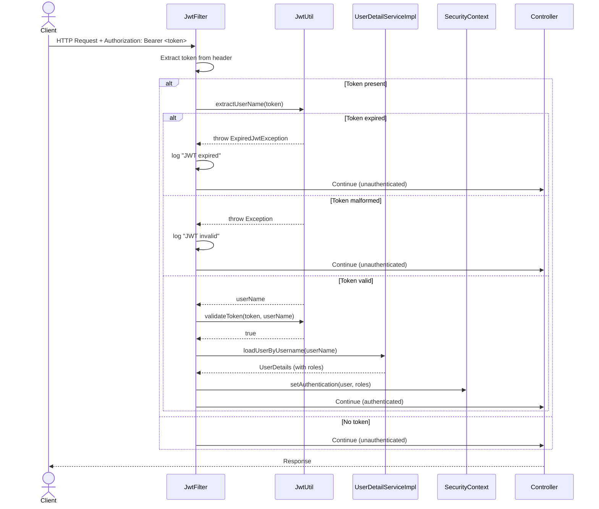

## 8. Journal Entry Create - Detailed Sequence

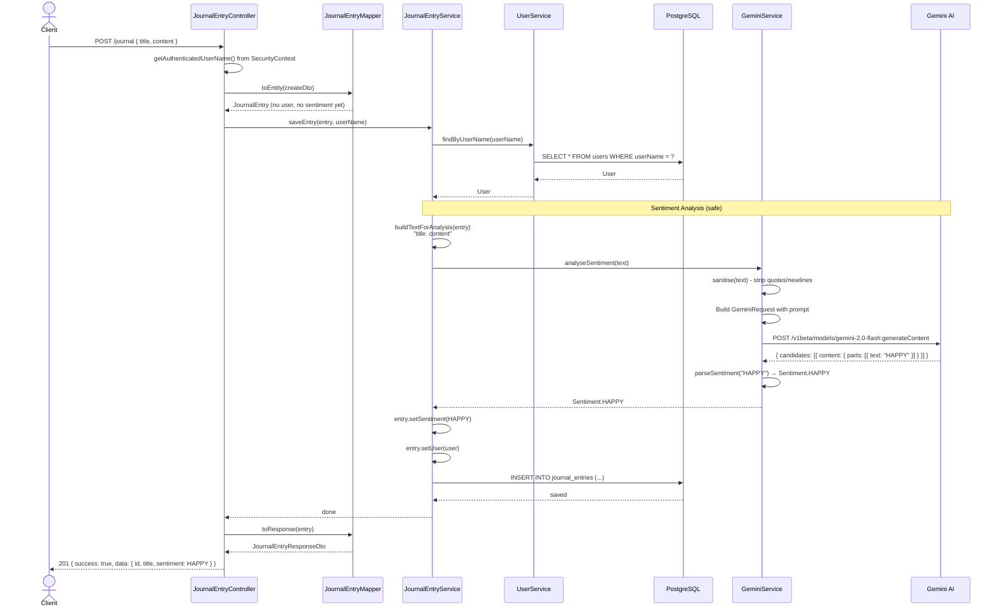

## 9. Weekly Sentiment Report - Detailed Sequence

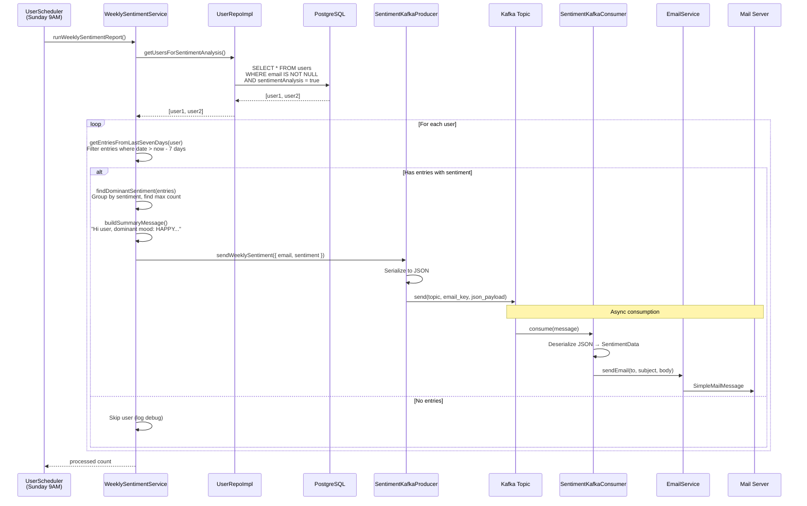

## 10. Weather with Redis Cache - Detailed Sequence

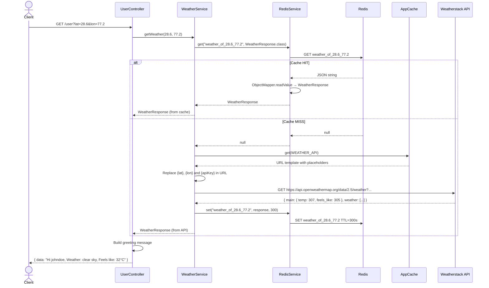

## 11. Error Handling - Detailed Flow

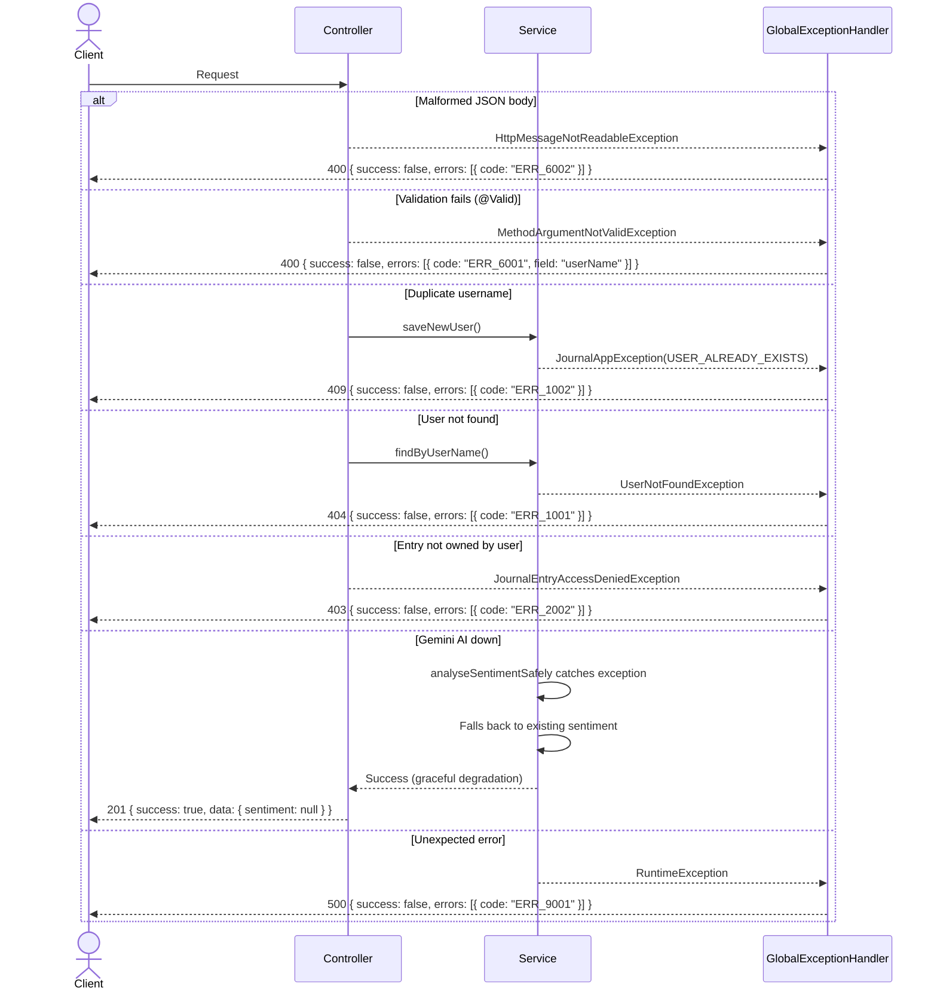

## 12. Unified API Response Structure

Every endpoint returns this envelope:

```json
{
    "success": true,
    "message": "Operation completed.",
    "data": { },
    "errors": [
        {
            "code": "ERR_XXXX",
            "message": "Human readable error",
            "field": "fieldName (for validation errors)"
        }
    ],
    "metadata": { }
}
```

- `success` → always present (true/false)
- `message` → human-readable summary
- `data` → payload (null on errors)
- `errors` → list of errors (null on success)
- `metadata` → reserved for pagination (empty for now)