# Journal App — Technical Presentation

---

## Slide 1: Title

**Journal App**
AI-Powered Journal & Mental Wellness Tracker

Tech Stack: Spring Boot 3.5 · PostgreSQL · Redis · Kafka · Gemini AI · OpenWeatherMap

Presented by: Trishal

---

## Slide 2: What is Journal App?

A secure, AI-powered journaling platform that helps users:

- Write and manage personal journal entries
- Automatically detect emotional sentiment (HAPPY / SAD / ANGRY / ANXIOUS) using Google Gemini AI
- Receive weekly sentiment summary reports via email
- Get personalised weather-based greetings

Built as a production-ready REST API with JWT authentication, role-based access control, and event-driven architecture.

---

## Slide 3: Use Cases

| # | Use Case | Description |
|---|----------|-------------|
| 1 | Mental Health Tracking | Track emotional patterns over time through AI-analysed journal entries |
| 2 | Personal Notes / Diary | Use as a secure, private digital diary for daily thoughts |
| 3 | Weekly Mood Reports | Automated email summaries showing dominant mood and breakdown |
| 4 | Therapist Integration | Share sentiment trends with mental health professionals |
| 5 | Self-Awareness Tool | Identify emotional triggers by reviewing sentiment history |
| 6 | Weather-Mood Correlation | Combine weather data with mood tracking for deeper insights |
| 7 | Team Wellness (Enterprise) | Admins can monitor aggregated sentiment trends across users |
| 8 | Gratitude Journaling | Dedicated space for positive reflection and mindfulness |

---

## Slide 4: Tech Stack Overview

| Layer | Technology |
|-------|-----------|
| Backend Framework | Spring Boot 3.5.5 (Java 17) |
| Database | PostgreSQL (Supabase) |
| Cache | Redis Cloud |
| Message Broker | Apache Kafka (Redpanda Cloud) |
| AI / Sentiment | Google Gemini 2.0 Flash API |
| Weather | OpenWeatherMap API |
| Authentication | JWT (HS256, 1-hour expiry) |
| Email | Gmail SMTP (JavaMailSender) |
| API Docs | Swagger UI (SpringDoc OpenAPI) |
| Containerisation | Docker + Docker Compose |

---

## Slide 5: High Level Design (HLD)

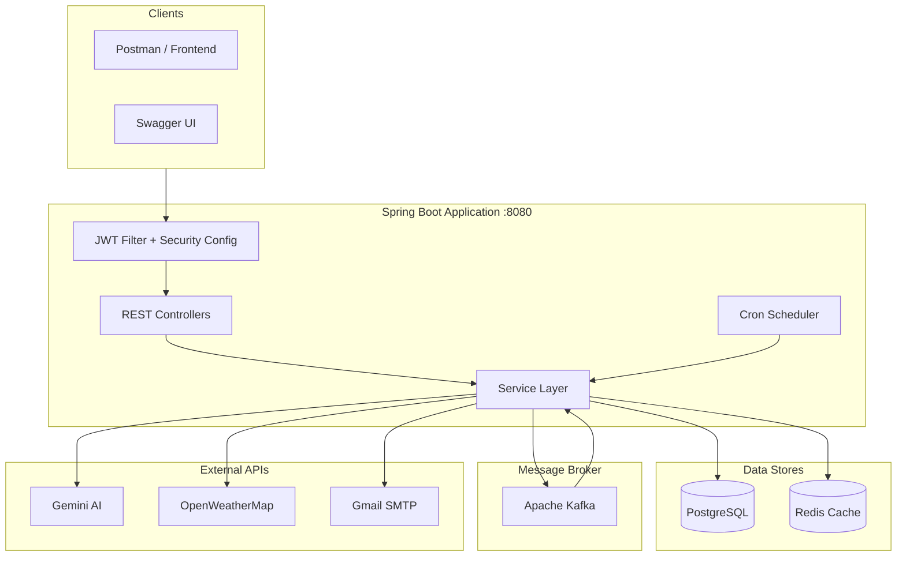

---

## Slide 6: HLD — Component Responsibilities

| Component | Responsibility |
|-----------|---------------|
| JwtFilter | Extracts and validates JWT from every request |
| SecurityConfig | Route-level authorization (PUBLIC / USER / ADMIN) + CORS |
| PublicController | Signup, Login, Health Check (no auth) |
| JournalEntryController | CRUD for journal entries (authenticated users) |
| UserController | Profile update, delete, weather greeting |
| AdminController | User management, config management, sentiment reports |
| GeminiService | Calls Gemini AI for sentiment classification |
| WeatherService | Fetches weather via OpenWeatherMap with Redis caching |
| WeeklySentimentService | Aggregates weekly mood data, publishes to Kafka |
| ConfigService | CRUD for app config entries (API URLs stored in DB) |
| EmailService | Sends plain-text emails via SMTP |
| Kafka Producer/Consumer | Async event pipeline for sentiment report emails |

---

## Slide 7: Low Level Design — Entity Relationship

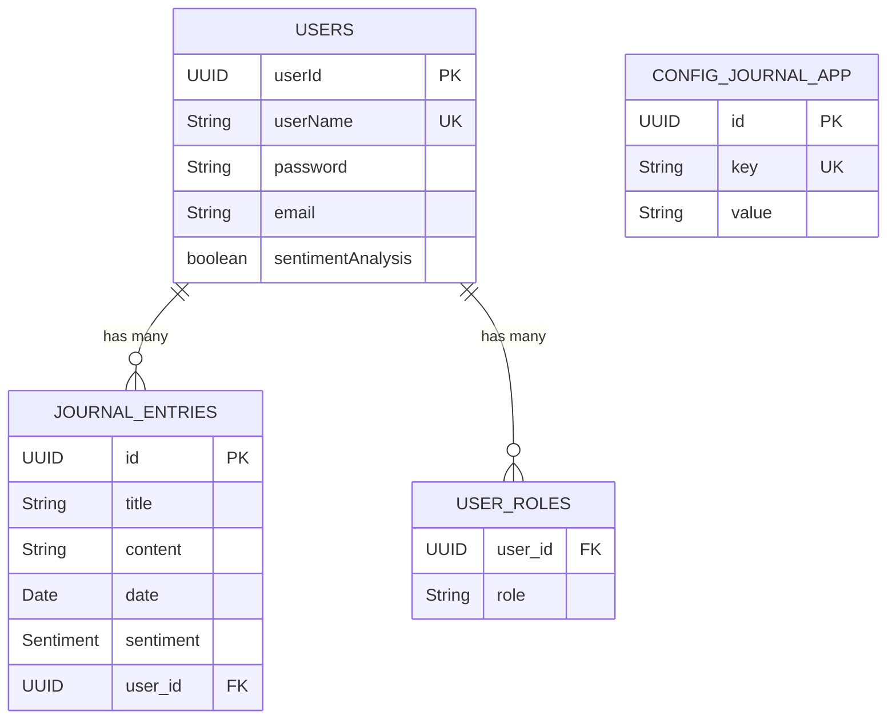

---

## Slide 8: LLD — Security Flow

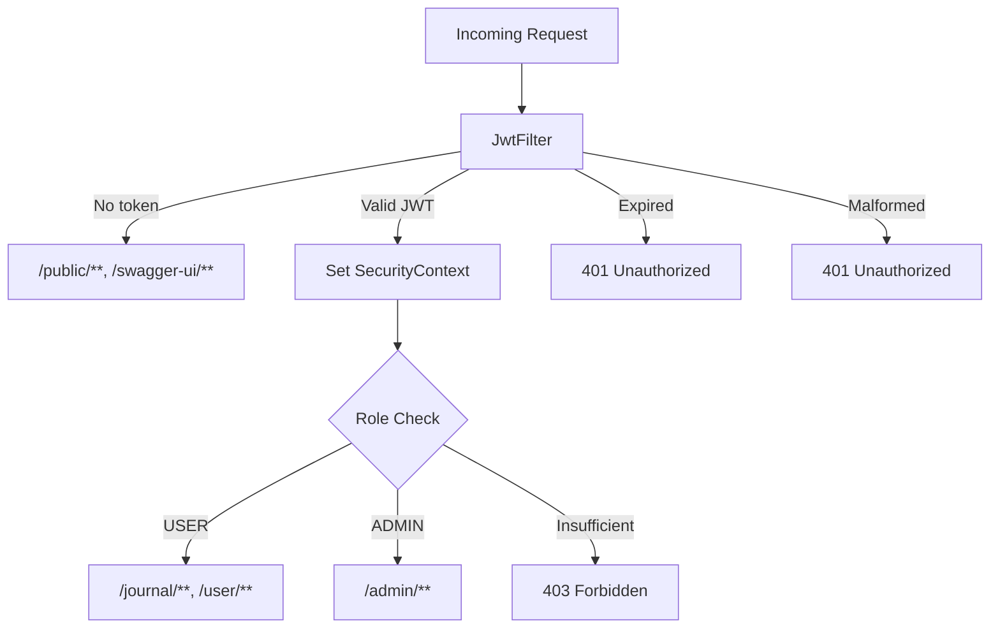

---

## Slide 9: LLD — Unified API Response

Every endpoint returns this envelope:

```json
{
    "success": true,
    "message": "Operation completed.",
    "data": { ... },
    "errors": [
        {
            "code": "ERR_XXXX",
            "message": "Human readable error",
            "field": "fieldName"
        }
    ],
    "metadata": { }
}
```

- success: always present (true/false)
- data: payload on success, null on error
- errors: list of structured errors on failure
- metadata: reserved for pagination (future)

---

## Slide 10: Flow 1 — User Signup

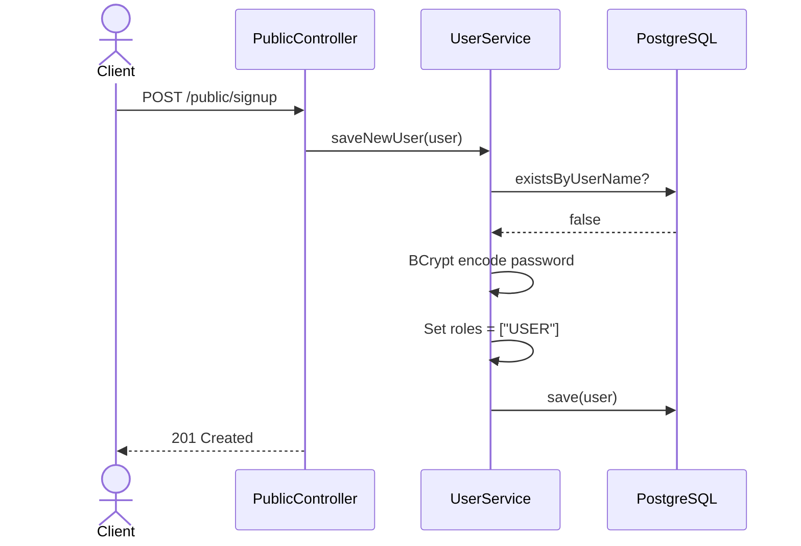

Request Body:
```json
{
    "userName": "johndoe",
    "password": "password123",
    "email": "johndoe@example.com",
    "sentimentAnalysis": true
}
```

Success Response (201):
```json
{
    "success": true,
    "message": "User registered successfully.",
    "data": {
        "userId": "uuid",
        "userName": "johndoe",
        "email": "johndoe@example.com",
        "sentimentAnalysis": true,
        "roles": ["USER"],
        "journalEntryCount": 0
    }
}
```

Error — Duplicate Username (409):
```json
{
    "success": false,
    "message": "A user with this username already exists.",
    "errors": [{ "code": "ERR_1002", "message": "..." }]
}
```

Error — Validation Failed (400):
```json
{
    "success": false,
    "message": "Request validation failed.",
    "errors": [
        { "code": "ERR_6001", "field": "password", "message": "Password must be between 8 and 100 characters" }
    ]
}
```

---

## Slide 11: Flow 2 — User Login

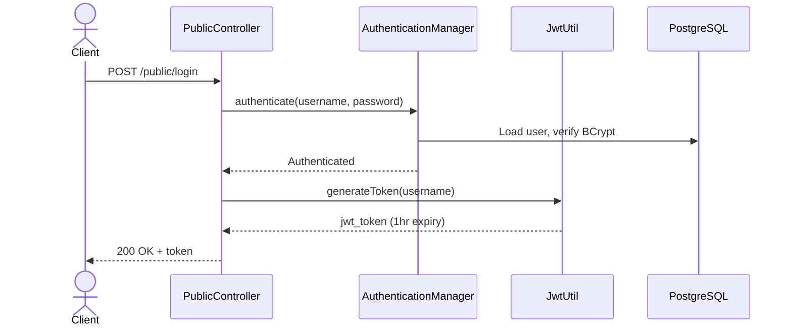

Request Body:
```json
{
    "userName": "johndoe",
    "password": "password123"
}
```

Success Response (200):
```json
{
    "success": true,
    "message": "Login successful.",
    "data": {
        "token": "eyJhbGciOiJIUzI1NiJ9...",
        "tokenType": "Bearer",
        "userName": "johndoe",
        "roles": ["USER"],
        "expiresIn": 3600
    }
}
```

Error — Bad Credentials (401):
```json
{
    "success": false,
    "message": "Invalid username or password.",
    "errors": [{ "code": "ERR_1006", "message": "Invalid username or password." }]
}
```

---

## Slide 12: Flow 3 — Create Journal Entry (with AI Sentiment)

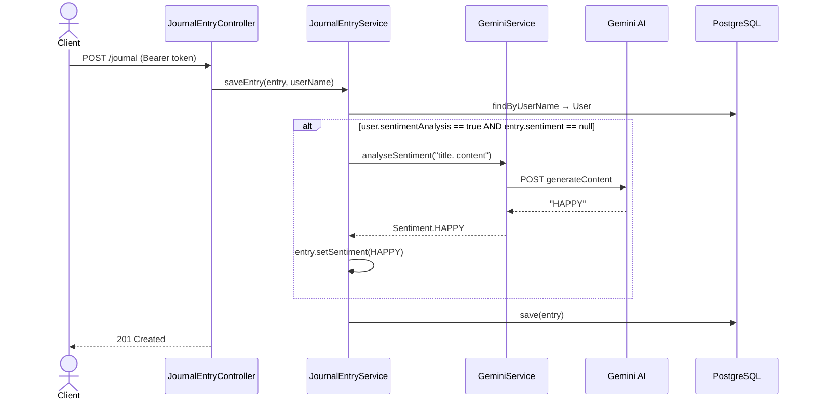

Request Body:
```json
{
    "title": "Great day at the park",
    "content": "Enjoyed sunshine and fresh air. Feeling grateful."
}
```

Success Response (201):
```json
{
    "success": true,
    "message": "Journal entry created.",
    "data": {
        "id": "uuid",
        "title": "Great day at the park",
        "content": "Enjoyed sunshine and fresh air. Feeling grateful.",
        "date": "2026-03-28T15:30:00.000+00:00",
        "sentiment": "HAPPY",
        "authorUserName": "johndoe"
    }
}
```

Note: If Gemini AI is unavailable, the entry is still saved with sentiment = null (graceful degradation).

---

## Slide 13: Flow 4 — Get All Journal Entries

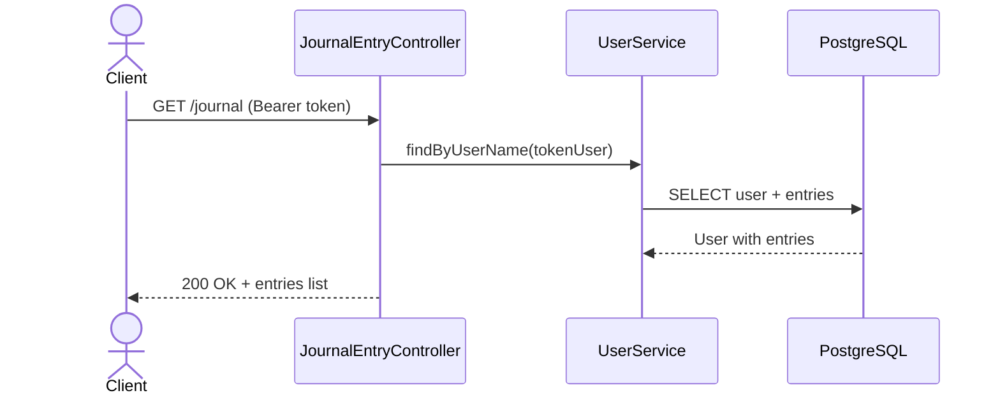

Success Response (200):
```json
{
    "success": true,
    "message": "Journal entries retrieved.",
    "data": [
        {
            "id": "uuid-1",
            "title": "Great day",
            "content": "...",
            "date": "2026-03-28T15:30:00.000+00:00",
            "sentiment": "HAPPY",
            "authorUserName": "johndoe"
        },
        {
            "id": "uuid-2",
            "title": "Rough day",
            "sentiment": "ANGRY",
            "authorUserName": "johndoe"
        }
    ]
}
```

---

## Slide 14: Flow 5 — Get / Update / Delete Entry by ID

**GET /journal/id/{id}** — Returns single entry (must be owned by authenticated user)

**PUT /journal/id/{id}** — Updates title/content, re-runs sentiment analysis

Request Body:
```json
{
    "title": "Updated title",
    "content": "Updated content reflecting on the day."
}
```

**DELETE /journal/id/{id}** — Removes entry from user and database

Success Response:
```json
{ "success": true, "message": "Journal entry deleted successfully." }
```

Error — Entry Not Owned (403):
```json
{
    "success": false,
    "message": "You do not have access to this journal entry.",
    "errors": [{ "code": "ERR_2002" }]
}
```

Error — Entry Not Found (404):
```json
{
    "success": false,
    "message": "Journal entry not found.",
    "errors": [{ "code": "ERR_2001" }]
}
```

---

## Slide 15: Flow 6 — Weather Greeting

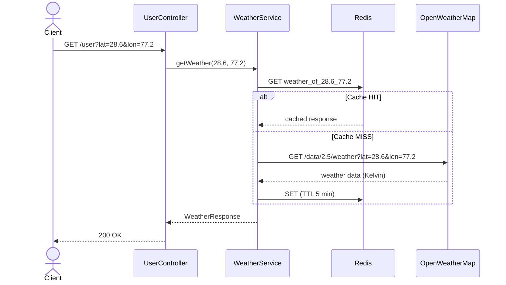

Success Response (200):
```json
{
    "success": true,
    "message": "Greeting retrieved.",
    "data": "Hi johndoe, Weather: clear sky, Feels like: 32.0°C"
}
```

Error — Weather API Down (503):
```json
{
    "success": false,
    "message": "Weather service is currently unavailable.",
    "errors": [{ "code": "ERR_4001" }]
}
```

---

## Slide 16: Flow 7 — Update User Profile

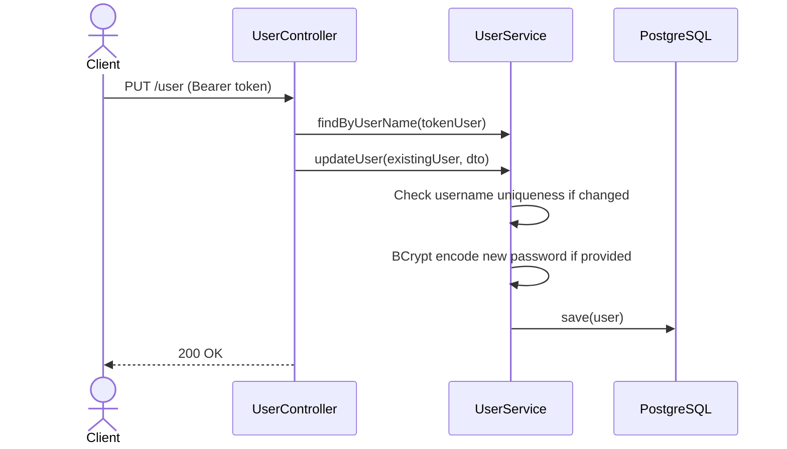

Request Body (all fields optional):
```json
{
    "userName": "johndoe_v2",
    "password": "newSecurePass123",
    "email": "newemail@example.com",
    "sentimentAnalysis": true
}
```

Success Response (200):
```json
{
    "success": true,
    "message": "User updated successfully.",
    "data": {
        "userId": "uuid",
        "userName": "johndoe_v2",
        "email": "newemail@example.com",
        "sentimentAnalysis": true,
        "roles": ["USER"]
    }
}
```

---

## Slide 17: Flow 8 — Weekly Sentiment Report (Async)

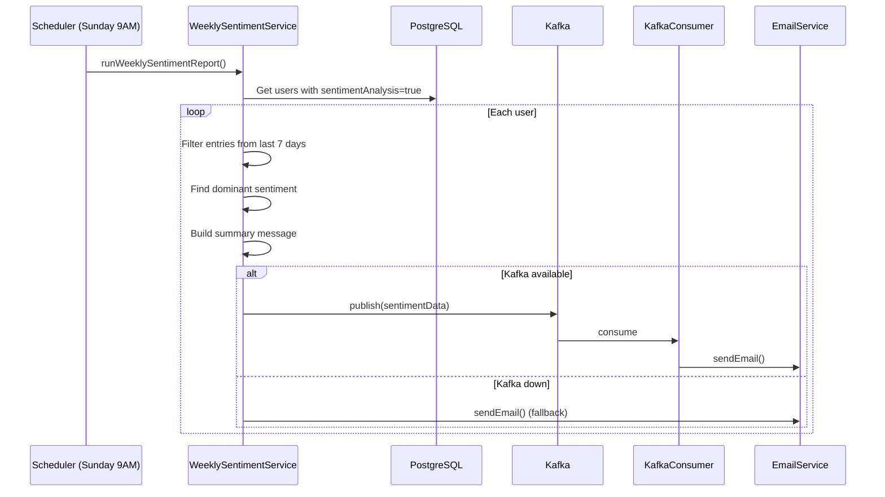

Email Content Example:
```
Hi johndoe,

Here is your weekly journal sentiment summary:

  • Total entries this week: 5
  • Dominant mood: HAPPY

Mood breakdown:
  • HAPPY: 3 entries
  • SAD: 1 entries
  • ANXIOUS: 1 entries

Keep journaling — see you next week!
```

Also triggerable manually: **POST /admin/trigger-weekly-sentiment** (ADMIN only)

---

## Slide 18: Flow 9 — Admin Endpoints Overview

| Endpoint | Method | Description |
|----------|--------|-------------|
| /admin/all-users | GET | List all registered users |
| /admin/create-admin-user | POST | Create a user with ADMIN role |
| /admin/clear-app-cache | GET | Force refresh in-memory config cache |
| /admin/trigger-weekly-sentiment | POST | Manually trigger weekly report |
| /admin/configs | GET | List all config entries |
| /admin/configs/{key} | PUT | Update a config value (e.g. API URLs) |
| /admin/users/{username} | PUT | Update any user's profile |
| /admin/users/{username}/journals | GET | View any user's journal entries |

All admin endpoints require JWT with ADMIN role. Regular users get 403 Forbidden.

---

## Slide 19: Flow 10 — Trigger Weekly Sentiment (Admin)

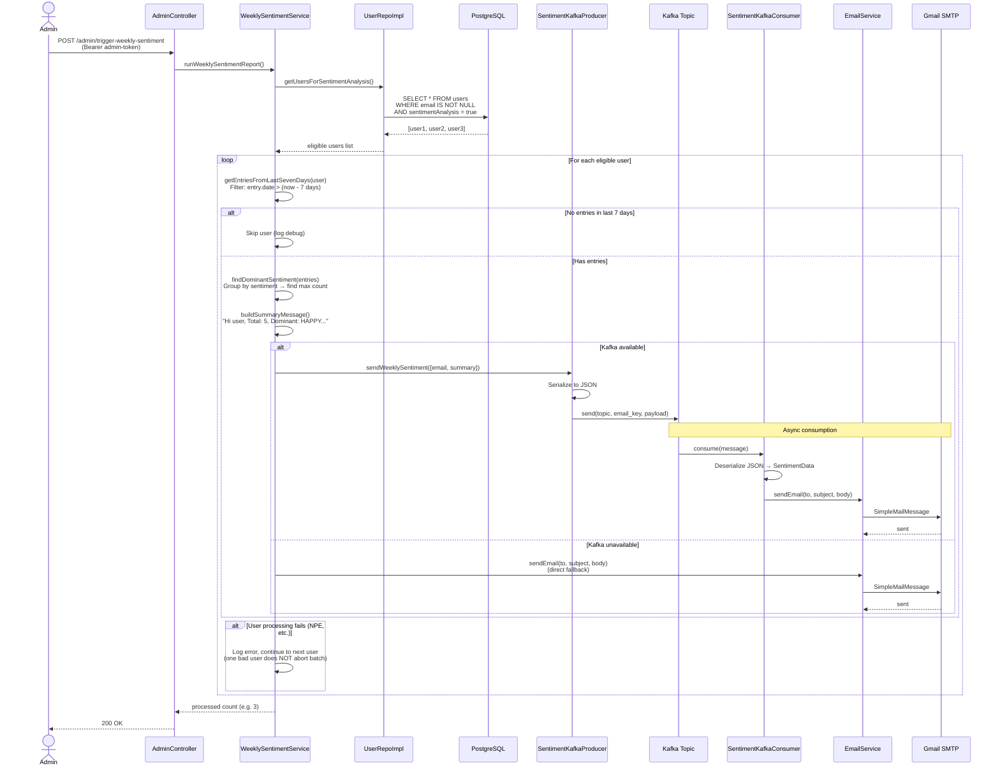

Response `200 OK`:
```json
{
    "success": true,
    "message": "Weekly sentiment report triggered. Processed 3 users."
}
```

Email sent to each user:
```
Hi johndoe,

Here is your weekly journal sentiment summary:

  • Total entries this week: 5
  • Dominant mood: HAPPY

Mood breakdown:
  • HAPPY: 3 entries
  • SAD: 1 entries
  • ANXIOUS: 1 entries

Keep journaling — see you next week!
```

---

## Slide 20: Flow 11 — Clear App Cache (Admin)

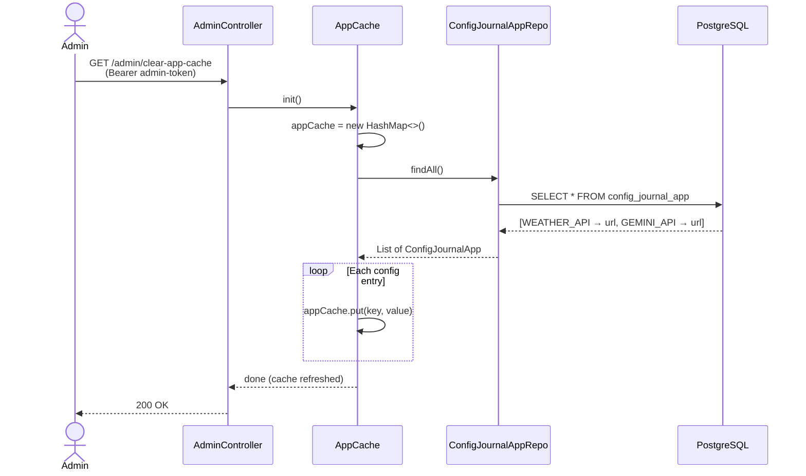

Response `200 OK`:
```json
{
    "success": true,
    "message": "App cache refreshed successfully."
}
```

What gets refreshed:
| Cache Key | Used By | Purpose |
|-----------|---------|---------|
| WEATHER_API | WeatherService | OpenWeatherMap URL template with placeholders |
| GEMINI_API | GeminiService | Gemini AI generateContent endpoint URL |

After this call, WeatherService and GeminiService immediately use the updated URLs from the refreshed cache.

---

## Slide 21: Flow 12 — Cron Jobs (Background Schedulers)

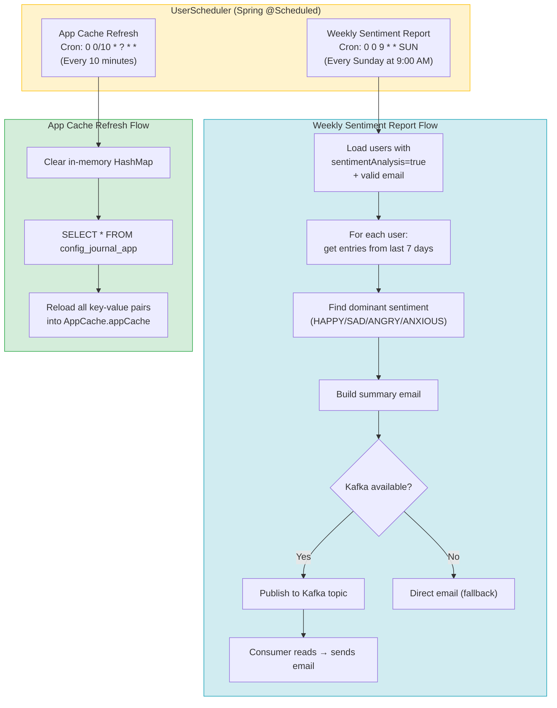

**Cron Job 1: Weekly Sentiment Report**

| Property | Value |
|----------|-------|
| Schedule | Every Sunday at 9:00 AM |
| Cron Expression | `0 0 9 * * SUN` |
| Method | `UserScheduler.fetchUsersAndSendSAMail()` |
| Delegates to | `WeeklySentimentService.runWeeklySentimentReport()` |
| Manual trigger | `POST /admin/trigger-weekly-sentiment` |

Detailed sequence:
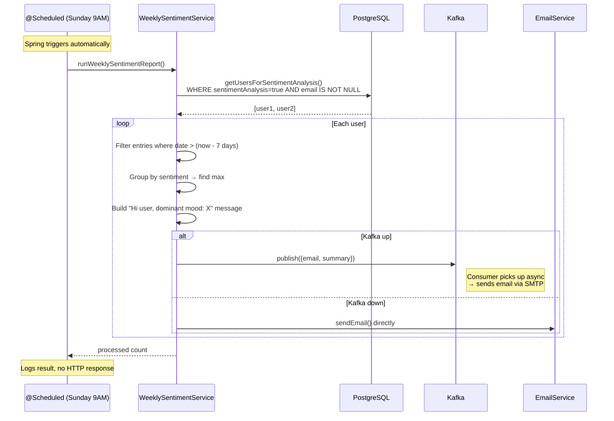

**Cron Job 2: App Cache Refresh**

| Property | Value |
|----------|-------|
| Schedule | Every 10 minutes |
| Cron Expression | `0 0/10 * ? * *` |
| Method | `UserScheduler.clearAppCache()` |
| Delegates to | `AppCache.init()` |
| Manual trigger | `GET /admin/clear-app-cache` |

Detailed sequence:
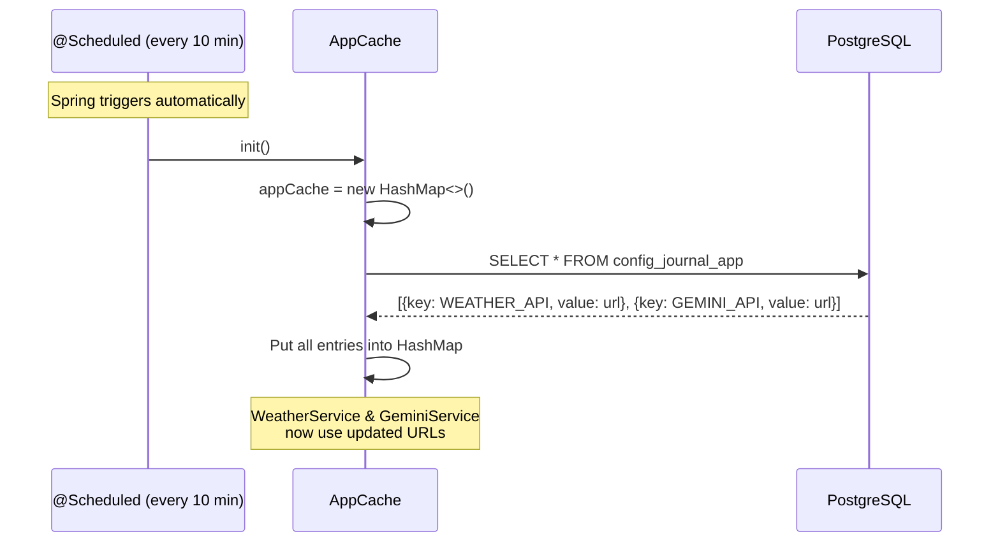

Why this matters:
- Config values (API URLs) are stored in the database
- Services read from the in-memory cache (not DB) for performance
- The 10-minute refresh ensures config changes propagate automatically
- Admin can force immediate refresh via `/admin/clear-app-cache`
- `PUT /admin/configs/{key}` also triggers immediate refresh after update

---

## Slide 22: Error Handling Architecture

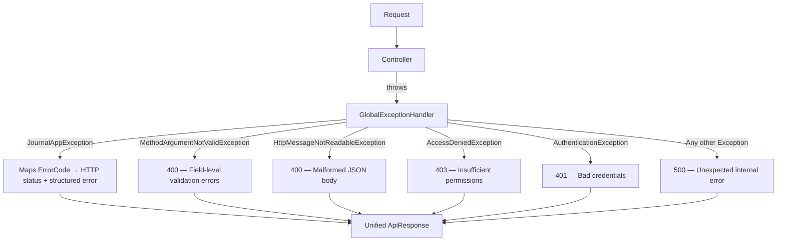

Error Code Ranges:
- ERR_1xxx — User errors (not found, duplicate, credentials)
- ERR_2xxx — Journal entry errors (not found, access denied)
- ERR_3xxx — Sentiment errors (analysis failed, invalid value)
- ERR_4xxx — External service errors (Weather, Gemini, Email, Kafka)
- ERR_5xxx — Auth/JWT errors (invalid, expired, access denied)
- ERR_6xxx — Validation errors (field validation, malformed body)
- ERR_9xxx — Generic internal errors

---

## Slide 23: API Endpoint Summary

| Auth | Method | Endpoint | Purpose |
|------|--------|----------|---------|
| None | GET | /public/health-check | Health check |
| None | POST | /public/signup | Register user |
| None | POST | /public/login | Get JWT token |
| JWT | GET | /journal | List my entries |
| JWT | POST | /journal | Create entry (AI sentiment) |
| JWT | GET | /journal/id/{id} | Get entry |
| JWT | PUT | /journal/id/{id} | Update entry |
| JWT | DELETE | /journal/id/{id} | Delete entry |
| JWT | GET | /user?lat=X&lon=Y | Weather greeting |
| JWT | PUT | /user | Update my profile |
| JWT | DELETE | /user | Delete my account |
| ADMIN | GET | /admin/all-users | List all users |
| ADMIN | POST | /admin/create-admin-user | Create admin |
| ADMIN | GET | /admin/clear-app-cache | Refresh cache |
| ADMIN | POST | /admin/trigger-weekly-sentiment | Force report |
| ADMIN | GET | /admin/configs | List configs |
| ADMIN | PUT | /admin/configs/{key} | Update config |
| ADMIN | PUT | /admin/users/{username} | Update user |
| ADMIN | GET | /admin/users/{username}/journals | View user journals |

---

## Slide 24: UI Screenshots

[Placeholder — attach screenshots here]

---

## Slide 25: Points for Improvement

**Security**
- Rate limiting on login/signup to prevent brute force attacks
- Refresh token mechanism (current JWT is single-use, 1hr expiry, no refresh)
- Password reset flow via email OTP
- Input sanitisation for XSS prevention on journal content

**Architecture**
- Pagination on list endpoints (journal entries, users, configs)
- Constructor injection instead of @Autowired field injection (testability)
- Centralised PasswordEncoder bean — UserService currently creates its own static instance
- Database migrations via Flyway/Liquibase instead of ddl-auto=create in prod

**Features**
- Full-text search across journal entries
- Sentiment trend graphs (daily/weekly/monthly)
- Journal entry tags/categories
- Export journal entries as PDF
- Multi-language sentiment analysis
- Push notifications (mobile) for weekly reports

**Observability**
- Structured logging with correlation IDs for request tracing
- Metrics export to Prometheus/Grafana (response times, error rates)
- Health checks for Redis, Kafka, and external APIs
- Distributed tracing with Micrometer + Zipkin

**DevOps**
- CI/CD pipeline (GitHub Actions) with automated test runs
- Separate Docker profiles for dev/staging/prod
- Secrets management via AWS Secrets Manager or HashiCorp Vault
- Remove sonar token from pom.xml (currently hardcoded)

---

## Slide 26: Thank You

Questions?

GitHub: github.com/trishal13/journalApp
Swagger: http://localhost:8080/docs